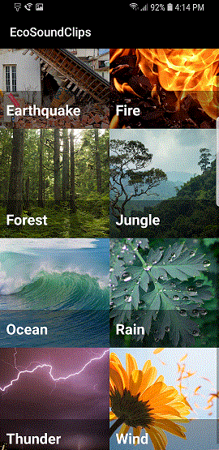

# EcoSoundClips
Android Studio project: 

## Synopsis

Name: EcoSoundClips

This is an Android app to play environmental sounds for the Grow with Google Android Basic Development Nanodegree Scholarship 2018.

There are 8 categories of environmental sounds: Earthquake, Fire, Forest, Jungle, Ocean, Rain, Thunder and Wind.  

When one of the MainActivity gid view photographs in the categories above is selected, a list of related sounds displays in a list on another Activity.

Clicking on the play button, to the right of each sound list, plays a clip of the environmental sound using Media Player.

 <kbd></kbd>

## Code Description

MainActivity, ImageAdapter, and ImageGrid display the 8 category photographs in the grid view.  The array list for the image grid is created on the 
ImageAdapter.

SoundActivity, SoundAdapter, are Sound display the list of songs related to the categories.  The sound array list is created on the SoundActivity file.

## Motivation

This is the fourth exercise in the "Grow with Google-  Android Basic Development Nanodegree 2018" program with Udacity.

The purpose of the exercise is to create "musical structure app." I opted for a app with environmental sounds instead of an albumn cover and songs.

## Installation

Project can be downloaded from GitHub:  https://github.com/hillc255/MiniScienceQuiz

## API Reference

## Tests (Future consideration!)

Describe and show how to run the tests with code examples.

## Contributors

Claudia Hill designed and developed this project.

## License

Only to be used for educational purposes.
